# nolimit-ds-test-Sri-Lutfiya-Dwiyeni

## MeetRecall AI Improvement

This project is an extension and architectural improvement of my original project, 
[MeetRecall AI](https://github.com/rilufiyy/MeetRecall-AI), which I previously developed independently. For this technical test, the system was significantly expanded into a full Meeting Intelligence Platform, 
adding a RAG-based chatbot, topic clustering, and per-speaker sentiment analysis.

Built for the NoLimit Indonesia Data Scientist Technical Test 
(Option C: RAG Chatbot + Bonus: Topic Clustering + Streamlit App).

---

## Table of Contents

1. [Features](#features)
2. [NLP Pipeline](#nlp-pipeline)
3. [Models Used](#models-used)
4. [Dataset](#dataset)
5. [Quick Start](#quick-start)
6. [API Reference](#api-reference)
7. [Project Structure](#project-structure)
8. [Sample Output](#sample-output)
9. [Technical Test Checklist](#technical-test-checklist)

---

## Features

| Feature | Description |
|---|---|
| **Transcription** | Upload audio/video → speaker-labelled transcript (local or cloud) |
| **RAG Chatbot** | Ask questions about a meeting → grounded answer + cited source segments |
| **Topic Clustering** | Discover themes discussed using KMeans or HDBSCAN |
| **Sentiment Analysis** | Per-speaker positive / neutral / negative sentiment breakdown |

---

## NLP Pipeline

See **[Flowchart.pdf](Flowchart.pdf)** for the full visual diagram (mandatory for technical test).

```
Audio / Video Input  (MP4 · MKV · MP3 · WAV · M4A · WEBM · OGG · FLAC)
        │
        ▼
  FFmpeg Conversion ──── Decode → 16 kHz Mono WAV
        │
        ▼
  Provider Selection
   ┌────┴────────────────────────────────────────┐
   │ Local (HuggingFace)                         │ Cloud
   ▼                                             ▼
openai/whisper-small                  AssemblyAI Universal-3 Pro
  (ASR transcription)                   (ASR + speaker labels)
   │
   ▼
pyannote/speaker-diarization-3.1
  (speaker segmentation)
   │
   ▼
Segment Alignment
  (timestamp overlap: ASR ↔ diarization)
        │
        ▼
Speaker-labelled Transcript  [{speaker, start, end, text}]  →  JSON storage
        │                                      │
        ▼                                      ▼
sentence-transformers/                 Group segments by speaker
paraphrase-multilingual-MiniLM-L12-v2         │
  (384-dim L2-normalised embeddings)          ▼
        │                          cardiffnlp/twitter-roberta-base-sentiment
   ┌────┴────────────────┐           (per-speaker batch inference)
   ▼                     ▼                     │
FAISS IndexFlatIP    KMeans / HDBSCAN          ▼
(per-meeting index)  (segment clustering)  Speaker Sentiment
   │                     │              (positive / neutral / negative)
   ▼                     ▼
RAG Retrieval       Semantic Label Generation
(top-k cosine sim)  (Qwen2 LLM → 4-6 word label
   │                 fallback: centroid sentence)
   ▼                     │
Qwen/Qwen2-0.5B-Instruct ▼
  (grounded answer gen)  Topic Clusters
   │                     (label · speakers · time range · samples)
   ▼
Q&A Response
(answer + keywords + action items + cited source segments)
```

---
## Application Interface

### Main Interface
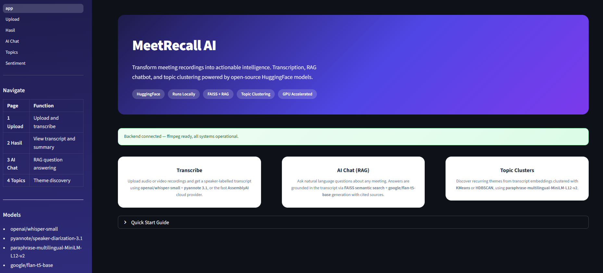

### Upload Page
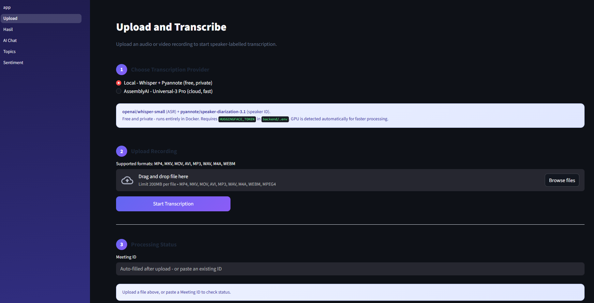

### Processing Status
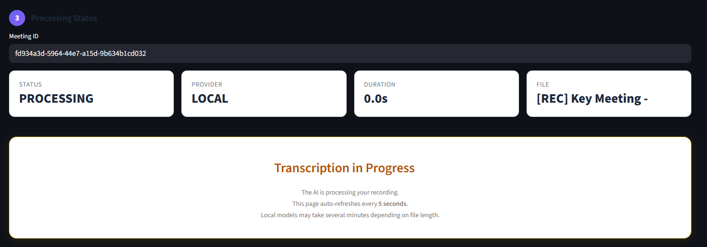

---

## Transcription & Speaker Analysis

### Transcription Result
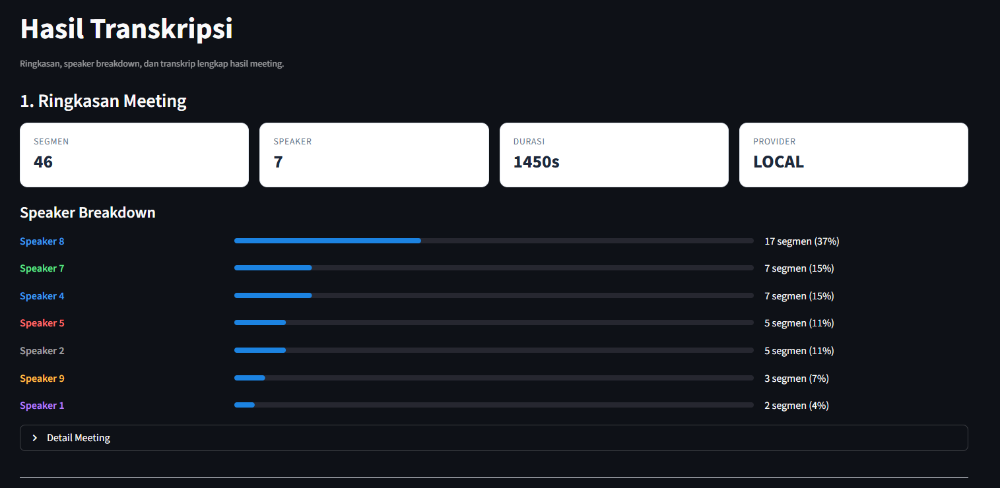

### Speaker Transcription Detail
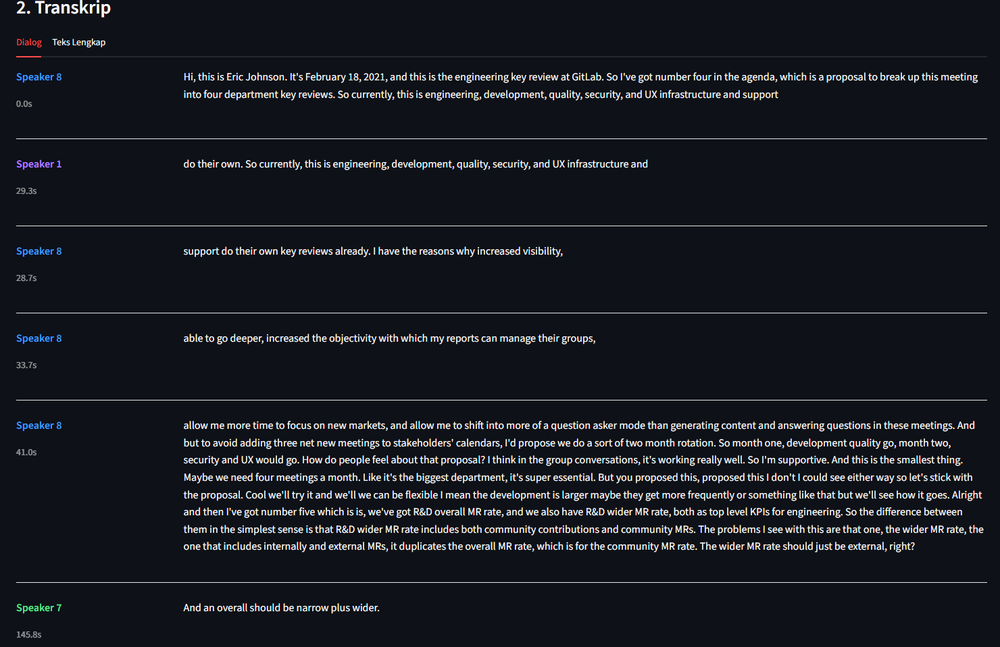

---

## NLP Analysis

### Topic Clustering Overview
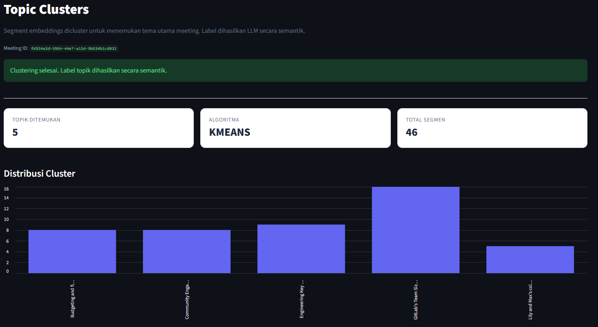

### Topic Clustering Detail
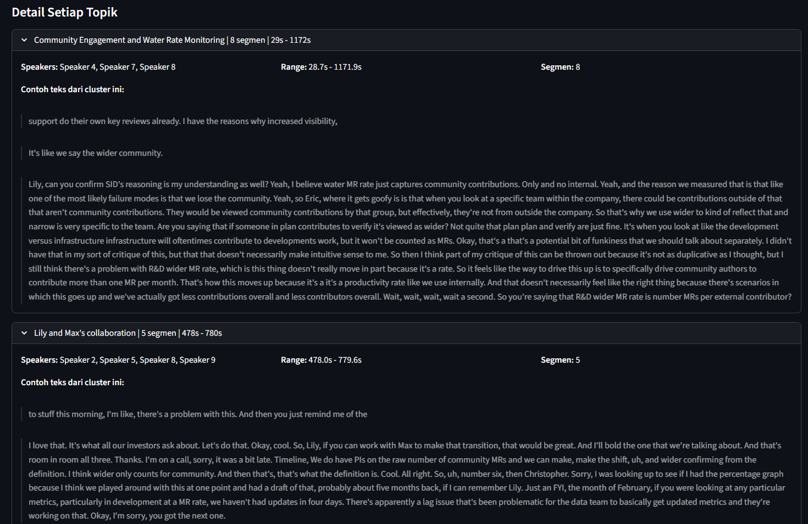

### Sentiment Analysis
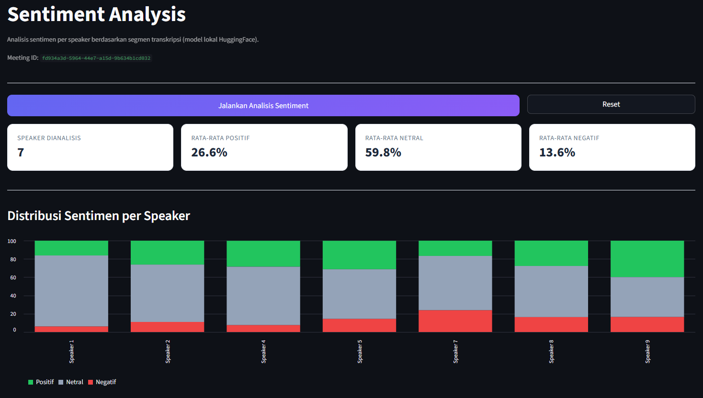

### Detail per Speaker
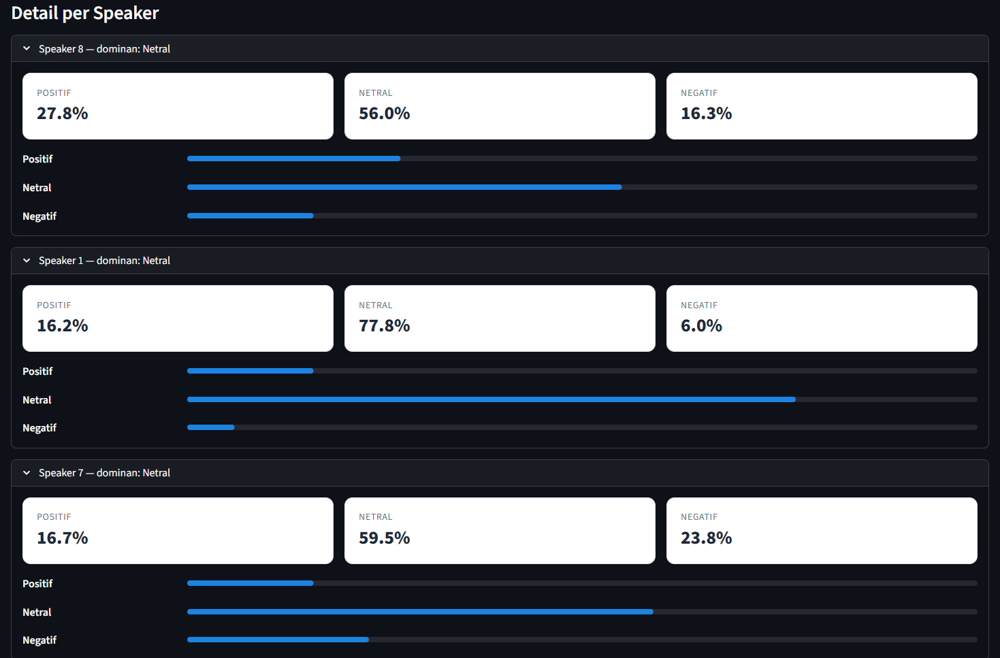

---

## RAG Chatbot

The system includes a Retrieval-Augmented Generation (RAG) chatbot that allows users to ask questions about meeting content.

Example queries:
- *"What decisions were made?"*
- *"What did Speaker A discuss?"*
- *"Summarize the meeting outcome."*

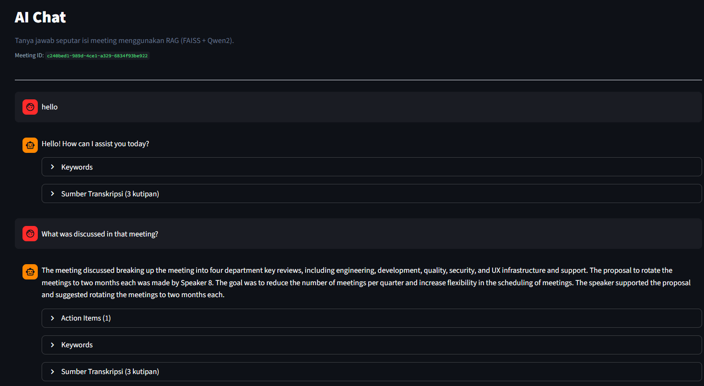

---

## Models Used

| Model | Source | Size | Purpose |
|---|---|---|---|
| `openai/whisper-small` | [HuggingFace](https://huggingface.co/openai/whisper-small) | ~390 MB | Automatic Speech Recognition (ASR) |
| `pyannote/speaker-diarization-3.1` | [HuggingFace](https://huggingface.co/pyannote/speaker-diarization-3.1) *(gated)* | ~370 MB | Speaker diarization |
| `sentence-transformers/paraphrase-multilingual-MiniLM-L12-v2` | [HuggingFace](https://huggingface.co/sentence-transformers/paraphrase-multilingual-MiniLM-L12-v2) | ~117 MB | Text embeddings — 384-dim, multilingual (EN + ID + 50 languages) |
| `Qwen/Qwen2-0.5B-Instruct` | [HuggingFace](https://huggingface.co/Qwen/Qwen2-0.5B-Instruct) | ~370 MB fp16 | Causal LLM — RAG answer generation + cluster label generation |
| `google/flan-t5-base` | [HuggingFace](https://huggingface.co/google/flan-t5-base) | ~290 MB | Seq2Seq LLM fallback (override via `RAG_LLM_MODEL` env var) |
| `cardiffnlp/twitter-roberta-base-sentiment` | [HuggingFace](https://huggingface.co/cardiffnlp/twitter-roberta-base-sentiment) | ~350 MB | Per-speaker sentiment classification |
| `sklearn.cluster.KMeans` | [scikit-learn](https://scikit-learn.org) | — | Topic clustering (default, deterministic) |
| `hdbscan.HDBSCAN` | [hdbscan](https://hdbscan.readthedocs.io) | — | Topic clustering (density-based, auto cluster count) |
| AssemblyAI Universal-3 Pro | [AssemblyAI](https://www.assemblyai.com) | Cloud API | Fast cloud transcription with native speaker labels (optional) |

### Why these models?

- **whisper-small** — Best open-source ASR quality-to-size ratio; multilingual; runs on CPU without quantisation.
- **pyannote/speaker-diarization-3.1** — State-of-the-art speaker diarization; integrates cleanly with Whisper timestamps.
- **paraphrase-multilingual-MiniLM-L12-v2** — Only 117 MB; supports Indonesian and English natively; fast enough for real-time indexing; produces cosine-compatible L2-normalised vectors.
- **Qwen2-0.5B-Instruct** — Smallest instruction-tuned causal LLM with solid multilingual capability; chat template built-in; runs on CPU in fp16 within ~2 GB RAM.
- **cardiffnlp/twitter-roberta-base-sentiment** — Pre-trained on social text; generalises well to conversational speech transcripts; fast batch inference.
- **KMeans** — Deterministic, fast, works with any segment count; n_clusters configurable by user.
- **HDBSCAN** — Density-based; automatically determines cluster count; handles noise/outlier segments.

---

## Dataset

### Source

User-uploaded meeting recordings (user-generated content).

#### Primary Dataset (Used in Testing)
Meeting recording sourced from YouTube: https://www.youtube.com/live/qGFoZ8yodc4?si=sdlA9fhfZe0a9ho2

##### Used for:
- transcription validation
- speaker diarization testing
- RAG retrieval evaluation
- clustering experimentation
- sentiment analysis

This dataset represents real conversational meeting data.

### Supported Input Formats

Any audio/video container supported by FFmpeg:

`.mp4` · `.mkv` · `.mov` · `.avi` · `.mp3` · `.wav` · `.m4a` · `.webm` · `.ogg` · `.flac`

### Annotation Method

Speaker labels are produced **automatically** — no manual annotation required:

| Provider | Method |
|---|---|
| Local | Pyannote diarization assigns `SPEAKER_00`, `SPEAKER_01`, … via timestamp overlap |
| AssemblyAI | Native speaker labelling built into the Universal-3 Pro model |

### License

| Component | License |
|---|---|
| openai/whisper-small | [MIT](https://github.com/openai/whisper/blob/main/LICENSE) |
| pyannote/speaker-diarization-3.1 | [MIT](https://huggingface.co/pyannote/speaker-diarization-3.1) — model weights require HuggingFace account acceptance |
| sentence-transformers, paraphrase-multilingual-MiniLM-L12-v2 | [Apache-2.0](https://huggingface.co/sentence-transformers/paraphrase-multilingual-MiniLM-L12-v2) |
| Qwen/Qwen2-0.5B-Instruct | [Apache-2.0](https://huggingface.co/Qwen/Qwen2-0.5B-Instruct) |
| cardiffnlp/twitter-roberta-base-sentiment | [MIT](https://huggingface.co/cardiffnlp/twitter-roberta-base-sentiment) |
| FAISS | [MIT](https://github.com/facebookresearch/faiss/blob/main/LICENSE) |
| scikit-learn | [BSD-3-Clause](https://github.com/scikit-learn/scikit-learn/blob/main/COPYING) |
| google/flan-t5-base | [Apache-2.0](https://huggingface.co/google/flan-t5-base) |
| AssemblyAI Universal-3 Pro | Commercial API — [free tier available](https://www.assemblyai.com/pricing) |
| Sample data (`sample_data/`) | **CC0** — synthetic, no real speakers |

---

## Quick Start

### Prerequisites

- [Docker](https://docs.docker.com/get-docker/) + [Docker Compose](https://docs.docker.com/compose/) v2
- *(Optional)* NVIDIA GPU with [nvidia-container-toolkit](https://docs.nvidia.com/datacenter/cloud-native/container-toolkit/install-guide.html) for faster inference

### 1. Clone & configure

```bash
git clone https://github.com/<your-username>/nolimit-ds-test-<name>.git
cd nolimit-ds-test-<name>

cp backend/.env.example backend/.env
```

Edit `backend/.env` and fill in:

```env
HUGGINGFACE_TOKEN=hf_...      # required — for pyannote gated model
ASSEMBLY_API_KEY=...          # optional — only needed for AssemblyAI provider
RAG_LLM_MODEL=Qwen/Qwen2-0.5B-Instruct   # optional — override default LLM
```

### 2. Build & start

```bash
docker-compose up -d --build
```

> **First run**: HuggingFace model weights (~1.3 GB total) are downloaded automatically and cached in a Docker volume. Subsequent restarts are instant.

> **No GPU?** Open `docker-compose.yml` and remove the `deploy.resources.reservations.devices` block under the `backend` service.

### 3. Open

| Service | URL |
|---|---|
| Streamlit UI | http://localhost:8502 |
| FastAPI interactive docs | http://localhost:8080/docs |

### 4. Usage walkthrough

1. **Upload** → go to `1 · Upload`, choose provider (Local or AssemblyAI), upload an audio file, wait for processing to complete.
2. **Results** → go to `2 · Hasil`, view speaker-labelled transcript and speaker breakdown, download raw text.
3. **AI Chat** → go to `3 · AI Chat`, select meeting, ask questions in any language, see cited source segments.
4. **Topics** → go to `4 · Topics`, select algorithm (KMeans / HDBSCAN) and cluster count, run clustering, explore topic cards.
5. **Sentiment** → go to `5 · Sentiment`, run analysis, view per-speaker positive/neutral/negative breakdown.

---

## API Reference

Base URL: `http://localhost:8080/api`

### Transcription

| Method | Path | Description |
|---|---|---|
| `POST` | `/transcribe` | Upload file (`multipart/form-data`), start async pipeline. Returns `meeting_id` (202). |
| `GET` | `/status/{id}` | Poll processing status (`pending` / `processing` / `completed` / `failed`) |
| `GET` | `/transcript/{id}` | Get full transcript result (only when `completed`) |
| `GET` | `/meetings` | List all meetings, newest first |
| `DELETE` | `/transcript/{id}` | Delete meeting data + FAISS index (204) |

### RAG Chatbot

| Method | Path | Body | Description |
|---|---|---|---|
| `POST` | `/rag/chat/{id}` | `{query, top_k, history}` | Q&A with cited source chunks |
| `POST` | `/rag/reindex/{id}` | — | Force rebuild FAISS index |

### Topic Clustering

| Method | Path | Body | Description |
|---|---|---|---|
| `POST` | `/cluster/{id}` | `{method, n_clusters}` | Run clustering, get ClusterResult |
| `GET` | `/cluster/{id}` | — | Retrieve stored cluster result |

### Sentiment Analysis

| Method | Path | Description |
|---|---|---|
| `POST` | `/sentiment/{id}` | Run per-speaker sentiment, returns positive/neutral/negative scores |

### Health

| Method | Path | Description |
|---|---|---|
| `GET` | `/health` | Backend health check (includes ffmpeg availability) |

Full interactive docs: http://localhost:8080/docs

---

## Project Structure

```
MeetRecall/
├── backend/
│   ├── main.py                  ← FastAPI app, CORS, router registration
│   ├── models/
│   │   └── schemas.py           ← Pydantic v2 models (all request/response types)
│   ├── routers/
│   │   ├── transcribe.py        ← POST /transcribe, GET /status, /transcript, /meetings
│   │   ├── rag.py               ← POST /rag/chat/{id}, /rag/reindex/{id}
│   │   ├── clustering.py        ← POST/GET /cluster/{id}
│   │   └── sentiment.py         ← POST /sentiment/{id}
│   ├── services/
│   │   ├── transcription.py     ← WhisperSmallWithDiarizationProvider + AssemblyAIProvider
│   │   ├── embeddings.py        ← sentence-transformers singleton (384-dim)
│   │   ├── vector_store.py      ← FAISS IndexFlatIP, per-meeting .index + _chunks.pkl
│   │   ├── storage.py           ← JSON file persistence (data/meetings/)
│   │   ├── topic_cluster.py     ← KMeans / HDBSCAN + LLM semantic labelling
│   │   ├── rag_chain.py         ← FAISS search → context build → LLM generate
│   │   ├── llm.py               ← LLMService — auto-detects causal vs seq2seq
│   │   └── sentiment.py         ← cardiffnlp per-speaker sentiment pipeline
│   ├── requirements.txt
│   ├── Dockerfile
│   └── .env.example
├── frontend/
│   ├── app.py                   ← Landing page + health check
│   ├── pages/
│   │   ├── 1_Upload.py          ← File upload + async status polling
│   │   ├── 2_Hasil.py           ← Transcript results + speaker breakdown + download
│   │   ├── 3_AI_Chat.py         ← RAG chat with conversation memory + source citations
│   │   ├── 4_Topics.py          ← Cluster visualisation (bar chart + topic cards)
│   │   └── 5_Sentiment.py       ← Per-speaker sentiment bar chart + metrics
│   ├── utils/
│   │   ├── api_client.py        ← HTTP client (all backend calls, timeout handling)
│   │   └── styles.py            ← Shared CSS — purple/indigo theme, speaker colours
│   ├── requirements.txt
│   └── Dockerfile
├── docker-compose.yml           ← backend:8080, frontend:8502, GPU support
├── flowchart.png                ← mandatory end-to-end pipeline diagram
├── flowchart.pdf                ← PDF version of the same diagram
├── generate_flowchart.py        ← script to regenerate flowchart.png / .pdf
├── sample_data/
│   └── sample_transcript.txt   ← synthetic sprint meeting (12 min, 4 speakers)
└── README.md
```

---

## Sample Output

### RAG Chatbot — Q&A with Cited Sources
Retrieval-augmented response generated from indexed meeting transcript chunks.
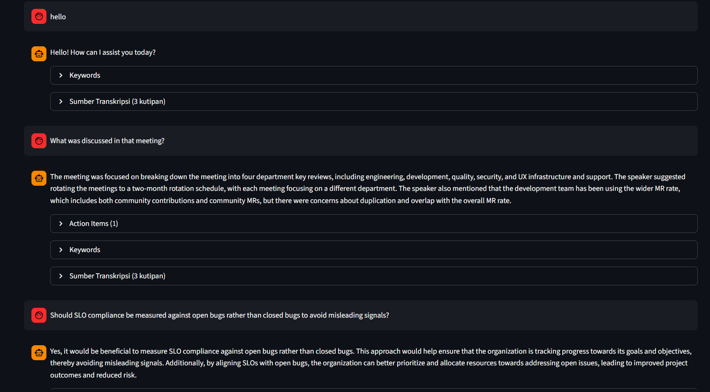

### Topic Clustering — Discovered Topics
Unsupervised clustering of meeting segments using semantic embeddings.


### Sentiment Analysis — Per Speaker
Per-speaker sentiment classification derived from segmented dialogue.

